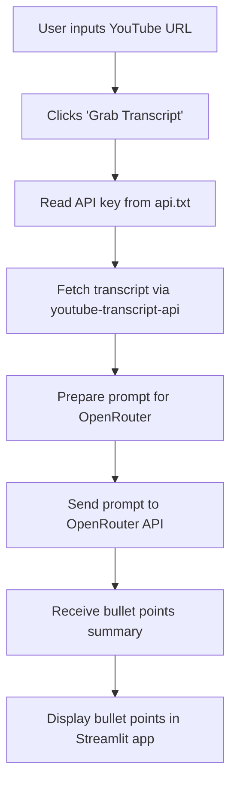

# YouTube Transcript Summarizer

## Overview
A Streamlit web app that extracts and summarizes YouTube video transcripts into concise key takeaways using OpenRouter's `quasar-alpha` model. Supports multilingual videos and provides a simple one-click interface.

## Features
- Fetches manual or autogenerated YouTube transcripts
- Summarizes content into bullet points
- Clean Streamlit UI
- Handles invalid URLs, missing transcripts, and API errors gracefully

## Demo / Usage
1. Enter a YouTube video URL
2. Click **"Grab Transcript"**
3. View the summarized key takeaways

**Example:**

_Input URL:_  
`https://www.youtube.com/watch?v=dQw4w9WgXcQ`

_Output:_  
- Bullet point 1  
- Bullet point 2  
- ...

## Setup

### 1. Clone the repository
```bash
git clone https://github.com/yourusername/youtube_transcript_grabber.git
cd youtube_transcript_grabber
```

### 2. Install dependencies
```bash
pip install -r requirements.txt
```

### 3. Obtain an OpenRouter API key
- Sign up at [OpenRouter](https://openrouter.ai/)
- Copy your API key

### 4. Save your API key
- Create a file named `api.txt` in the project root
- Paste your API key inside (single line, no spaces)

### 5. Change model
- edit line 85 with the proper model name from openrouter

## Running the App
```bash
streamlit run app.py
```
Then open `http://localhost:8501` in your browser.

## How it Works



## Dependencies
- streamlit
- youtube-transcript-api
- requests

## Notes
- Some videos may not have transcripts available
- Invalid API keys or network issues will show error messages
- Summaries depend on OpenRouter's model quality and API availability